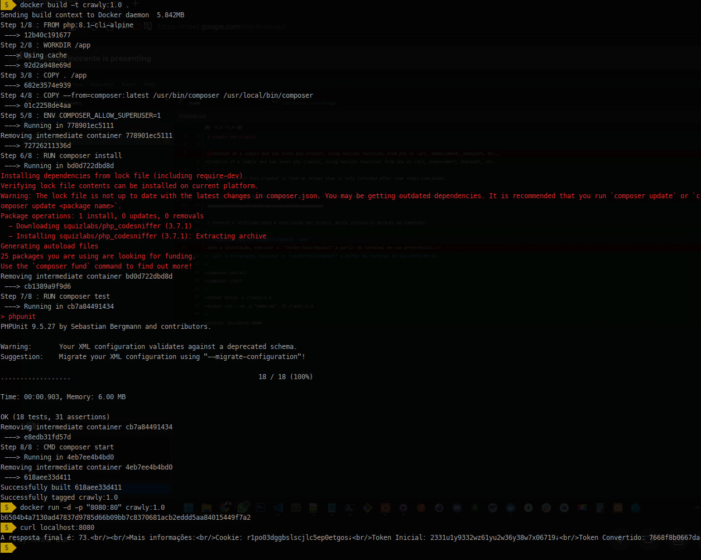

# Simple-PHP-Crawler

Creation of a simple and low level php crawler, using natives functions from php as curl, domdocument, domxpath, etc..

The objective of this Crawler is find an Answer that is only informed after some steps concluded.

To easily understood, we can divide it by steps (not necessary that the code respect it):

The first step requires to find the User's Cookie and Current Token after access the mocked URL;

At the second step, the code should convert Token to a specific format, converting some letters and codings. This conversor you can find at "TokenConversor.php";

The third step requires a POST to the same first url, but now, containing the converted token and the getted cookie to get another html response who have the answerd;

And the fourth and last step requires to identify what is the answer hidden in the middle of HTML and show at the screen;

###############################################

To run this project, basically you have to run:

- "docker build -t crawly:1.0 ."

After, this:

- "docker run --rm -p "8000:80" -it crawly:1.0"

And then, just access "http://localhost:8000/" to see the answer.

Here you can see the code running:

